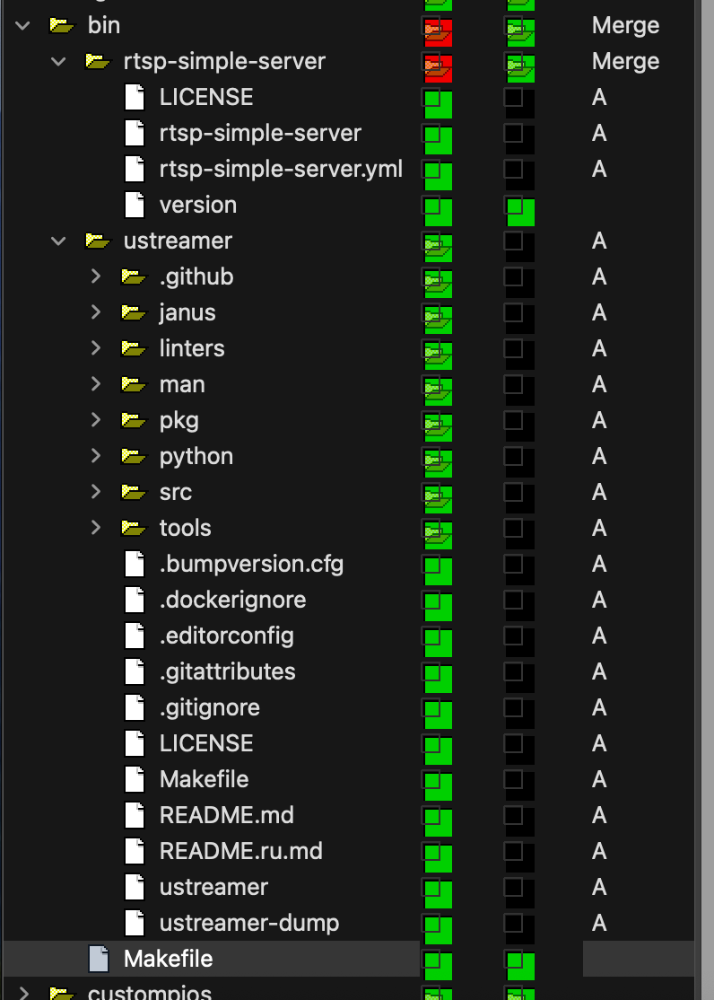

# Crowsnest Code Analysis

## Notes
The major differences between the Sovol code and the source commit code are in the `/bin/` directory. 
1. The `bin/ustreamer` directory does not exist in the source. 
2. The `bin/rtsp-simple-server` does exist in the source, but only has a 100% matching `bin/rtsp-simple-server/LICENSE` file.
3. The `bin/Makefile` is a 100% match, so the builds of each of these packages should result in identical binaries.

## Kdiff3 Folder Diff
{ height=300px }
